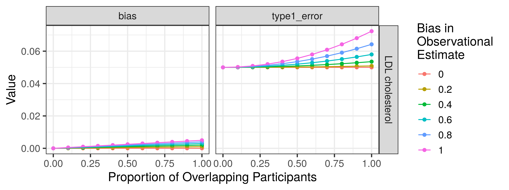

<!-- README.md is generated from README.Rmd. Please edit that file -->

# mrSampleOverlap

<!-- badges: start -->

[](https://lifecycle.r-lib.org/articles/stages.html#experimental)
[](https://github.com/mglev1n/mrSampleOverlap/actions/workflows/R-CMD-check.yaml)
[](https://github.com/mglev1n/mrSampleOverlap/actions/workflows/test-coverage.yaml)
<!-- badges: end -->

The goal of mrSampleOverlap is to estimate bias due to participant
overlap in Mendelian Randomization studies. This package implements code
described in Burgess et. al. 2016 (DOI:
[10.1002/gepi.21998](https://doi.org/10.1002/gepi.21998))

## Installation

You can install the development version of mrSampleOverlap from
[GitHub](https://github.com/) with:

``` r
# install.packages("devtools")
devtools::install_github("mglev1n/mrSampleOverlap")
```

## Usage

Here, we will use the `estimate_overlap_bias` function in a more complex
example, to estimate the bias across a range of possible values of
sample overlap and observational bias.

First, we will use the `TwoSampleMR` package to query the [MRC-IEU
OpenGWAS Project](https://gwas.mrcieu.ac.uk/) for summary GWAS data to
use for our exposure and outcome:

``` r
# devtools::install_github("MRCIEU/TwoSampleMR")
# install.packages("tidyverse")

library(tidyverse)
library(TwoSampleMR)
library(mrSampleOverlap)

# extract genetic instruments for BMI
ldl_exposure <- extract_instruments(outcomes = "ieu-a-300")

# extract corresponding outcome data for coronary artery disease
cad_outcome <- extract_outcome_data(snps = ldl_exposure$SNP, outcomes = "ebi-a-GCST005195")

# harmonize effect alleles, and keep only alleles present in both exposure and outcome data
dat_harmonized <- harmonise_data(ldl_exposure, cad_outcome) %>%
  filter(mr_keep == TRUE)
```

Next, we use `TwoSampleMR::add_rsq()` to add the R<sup>2</sup> value
necessary to calculate bias, and summarize:

``` r
dat_summarized <- dat_harmonized %>%
  add_rsq() %>%
  group_by(exposure) %>%
  summarize(rsq_exposure = sum(rsq.exposure), n_variants = n(), samplesize_exposure = max(samplesize.exposure), samplesize_outcome = max(samplesize.outcome))
```

We can use the `tidyr::crossing()` function to generate a grid
containing a range of values for sample overlap and observational bias

``` r
grid <- tidyr::crossing(overlap_prop = seq(0, 1, 0.1),
                        ols_bias = seq(0, 1, 0.2))
```

Finally, we can estimate bias in our MR estimates using the
`estimate_overlap_bias()` function:

``` r
bias_res <- dat_summarized %>%
  crossing(grid) %>%
  mutate(res = estimate_overlap_bias(samplesize_exposure = samplesize_exposure, samplesize_outcome = samplesize_outcome, n_variants = n_variants, rsq_exposure = rsq_exposure, overlap_prop = overlap_prop, ols_bias = ols_bias)) %>%
  unnest(res)
```

We can optionally plot our results. We see that as the proportion of
sample overlap increases, so does type 1 error, while bias remains
relatively small. Type 1 error and bias are also magnified as the bias
in the observational estimate increases:

``` r
bias_res %>%
  split_exposure() %>%
  pivot_longer(cols = c(bias, type1_error)) %>%
  ggplot(aes(overlap_prop, value, group = ols_bias, color = as.character(ols_bias))) +
    geom_point() +
    geom_line() +
    facet_grid(rows = vars(exposure), 
               cols = vars(name),
               scales = "free_y") +
  labs(x = "Proportion of Overlapping Participants",
       y = "Value") +
  scale_color_discrete(name = "Bias in \nObservational \nEstimate") +
  theme_bw(base_size = 14) 
```


